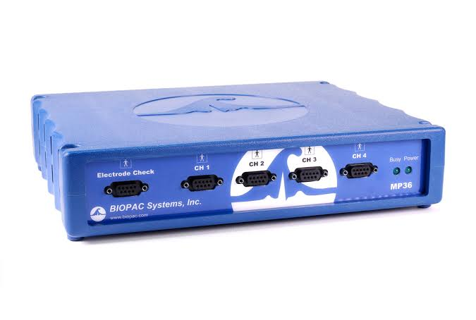

# sEMG-Based Non-Invasive Gesture Recognition for Bangla Sign Language
A machine learning pipeline for recognizing Bangla Sign Language (BdSL) gestures using surface electromyography (sEMG) signals acquired from forearm muscles.


## Research Status

This repository is intended to document and showcase the technical implementation of the research project. The associated manuscript is currently under review in "Advances in Human-Computer Interaction Journal.".

## Overview

This project investigates the use of surface electromyography (sEMG) as a non-invasive sensing modality for Bangla Sign Language gesture recognition.

Unlike camera-based approaches, sEMG captures the electrical activity generated by muscles during hand and wrist movements. In this work, signals from four forearm muscles are processed and transformed into a comprehensive set of time-domain, frequency-domain, time-frequency, nonlinear, entropy-based, and model-based features.

The resulting feature space is reduced using multiple feature-selection techniques and evaluated with four tree-based machine learning classifiers.

## Methodology

The overall pipeline is:

```text
sEMG Signals
     │
     ▼
Signal Segmentation
     │
     ▼
30–500 Hz Band-Pass Filtering
     │
     ▼
50 Hz Notch Filtering
     │
     ▼
Feature Extraction
(240 Features)
     │
     ▼
Feature Standardization
     │
     ▼
Baseline Model Comparison
(All 240 Features)
     │
     ├── Extra Trees
     ├── Random Forest
     ├── LightGBM
     └── XGBoost
     │
     ▼
Feature Selection
     │
     ├── RFE
     ├── Mutual Information
     ├── ANOVA F-Test
     └── LASSO-CV
     │
     ▼
Optimal Feature Subset Selection
(5–240 Features)
     │
     ▼
Classification with Selected Features
     │
     ├── Extra Trees
     ├── Random Forest
     ├── LightGBM
     └── XGBoost
     │
     ▼
Hyperparameter Optimization
     │
     ▼
Final Model Evaluation


## Research Objective

The primary objective is to develop a machine learning-based framework for recognizing Bangla Sign Language vowel gestures from sEMG signals.

The study focuses on:

Processing multi-channel sEMG signals
Extracting diverse signal features
Reducing the high-dimensional feature space
Comparing different feature-selection approaches
Identifying an efficient feature set for classification
Evaluating multiple machine learning classifiers


## Dataset

The dataset was acquired using a **4-channel BIOPAC MP36 data acquisition system** with surface EMG electrodes. It contains recordings of both **static and dynamic Bangla Sign Language gestures** collected from 10 participants.
<p align="center">
  
</p>

<p align="center">
  <strong>Figure 1. BIOPAC MP36 system used for EMG data acquisition.</strong>
</p>


The static gesture dataset consists of nine Bangla Sign Language vowel gestures. In addition, five commonly used Bangla Sign Language words were recorded as dynamic gestures for potential future research.

The dataset was collected as part of an academic research study on EMG-based Bangla Sign Language recognition.


---

## Experimental Setup

EMG signals were acquired at the Biomedical Laboratory of Chittagong University of Engineering and Technology (CUET), Bangladesh, using a 4-channel MP36 BIOPAC system (BIOPAC Systems, Inc., USA) with BIOPAC Student Lab (BSL) software.

SS2LB electrode lead sets with smart and simple sensor connectors were used together with disposable Ag/AgCl surface electrodes for non-invasive EMG signal acquisition.

Before electrode placement, the skin was cleaned with alcohol to remove oils and dead skin cells and to improve the quality of the recorded EMG signals.
Four forearm muscles were selected for EMG acquisition:

* Flexor Carpi Ulnaris (FCU)
* Extensor Carpi Ulnaris (ECU)
* Extensor Carpi Radialis (ECR)
* Flexor Carpi Radialis (FCR)

These muscles were selected because they contribute to important wrist movements, including flexion, extension, radial deviation, and ulnar deviation.


---

## Electrode Placement

<p align="center">
  
</p>

<p align="center">
  <strong>Figure 2. Electrode placement over the selected forearm muscles.</strong>
</p>

The surface electrodes were placed over four forearm muscles:

| Channel   | Muscle                  | Abbreviation |
| --------- | ----------------------- | ------------ |
| Channel 1 | Flexor Carpi Ulnaris    | FCU          |
| Channel 2 | Extensor Carpi Ulnaris  | ECU          |
| Channel 3 | Extensor Carpi Radialis | ECR          |
| Channel 4 | Flexor Carpi Radialis   | FCR          |
| Ground | Wrist/Tendon region where electrical activity was expected to be minimal  | None         |

---

## Dataset Description


The dataset contains both **static and dynamic Bangla Sign Language (BdSL) gestures**.

### Static Gestures — Bangla Vowels

Nine static gestures corresponding to the nine selected **Bangla vowels** were recorded. These gestures represent the following Bangla vowel characters:

| Gesture ID | Bangla Vowel | Type   |
| ---------- | ------------ | ------ |
| Static-01  | অ            | Static |
| Static-02  | আ            | Static |
| Static-03  | ই/ঈ          | Static |
| Static-04  | উ/ঊ          | Static |
| Static-05  | ঋ            | Static |
| Static-06  | এ            | Static |
| Static-07  | ঐ            | Static |
| Static-08  | ও            | Static |
| Static-09  | ঔ            | Static |

All nine static gestures are officially included in the **Bengali Sign Language Dictionary**.

### Dynamic Gestures — Common Bangla Sign Language Words

Five commonly used words from **Bangla Sign Language (BdSL)** were also recorded as dynamic gestures. These gestures were not analyzed in the current study and were retained for potential future research.

| Gesture ID | English Meaning | Bangla Word | Type    |
| ---------- | --------------- | ----------- | ------- |
| Dynamic-01 | Fish            | মাছ         | Dynamic |
| Dynamic-02 | Chicken         | মুরগি        | Dynamic |
| Dynamic-03 | Sweet           | মিষ্টি         | Dynamic |
| Dynamic-04 | Rice            | ভাত         | Dynamic |
| Dynamic-05 | Mother          | মা           | Dynamic |

All five dynamic gestures are part of the selected Bangla Sign Language vocabulary used during data collection.

### Dataset Summary

| Category      | Number of Classes | Instances per Class | Total Instances |
| ------------- | ----------------: | ------------------: | --------------: |
| Static vowels |                 9 |                 100 |             900 |
| Dynamic words |                 5 |                 100 |             500 |
| **Total**     |            **14** |                   — |       **1,400** |

Each gesture class contains **100 recorded instances**, obtained from 10 participants with 10 repetitions per gesture.

---

## Participants

Data were collected from **10 participants**.

| Parameter              | Description                                            |
| ---------------------- | ------------------------------------------------------ |
| Number of participants | 10                                                     |
| Age range              | 20–25 years                                            |
| Participant condition  | Healthy and physically fit                             |
| Training               | Participants received prior gesture-execution training |
| EMG channels           | 4                                                      |

Participants were trained using video lessons before data collection to improve consistency in gesture execution.

All participant identities are anonymized using participant IDs.

---

## Data Acquisition Protocol

Each gesture recording followed a fixed protocol.

For each trial:

1. The participant remained in a rest position for **3 seconds**.
2. The participant performed the selected sign gesture for **3 seconds**.
3. The procedure was repeated **10 times for each gesture**.

The same procedure was followed for all selected static and dynamic gestures.

The sampling frequency was set to **2000 Hz**, which satisfies the Nyquist sampling criterion for the frequency components of the recorded EMG signals.

### Recording Parameters

| Parameter                               | Value     |
| --------------------------------------- | --------- |
| Sampling frequency                      | 2000 Hz   |
| Rest duration                           | 3 seconds |
| Gesture duration                        | 3 seconds |
| Total duration per trial                | 6 seconds |
| Repetitions per gesture per participant | 10        |
| Number of participants                  | 10        |
| EMG channels                            | 4         |

At a sampling frequency of 2000 Hz, each 3-second segment contains approximately **6000 samples**.

---

## Dataset Statistics

### Static Gestures

The dataset contains:

* 10 participants
* 9 static gesture classes
* 10 repetitions per gesture per participant

Therefore:

**10 × 9 × 10 = 900 static gesture instances**

### Dynamic Gestures

The dataset contains:

* 10 participants
* 5 dynamic gesture classes
* 10 repetitions per gesture per participant

Therefore:

**10 × 5 × 10 = 500 dynamic gesture instances**

### Total

The complete dataset contains:

**900 static + 500 dynamic = 1400 recorded instances**

Each gesture class contains **100 instances** across the 10 participants and 10 repetitions.

---

## Dataset Organization

A simplified structure of the dataset is shown below:

```text
dataset/
│
├── Static_Gestures/
│   ├── Subject01/
        ├──ges1.xlsx/
        ├──ges2.xlsx/
        ├──....
│   ├── Subject02/
│   ├── Subject03/
│   └── ...
    
│
└── Dynamic_Gestures/
│   ├── Subject01/
        ├──dyn1.txt/
        ├──dyn2.txt/
        ├──....
│   ├── Subject02/
│   ├── Subject03/
│   └── ...
```

---

## Data Privacy

The dataset was collected from human participants.

To protect participant privacy:

* Participant names are not included.
* Personal identifying information is not included.
* Participants are represented using anonymized IDs.
* Consent forms and other confidential documents are not included in this repository.

The public release of the dataset will be subject to the applicable research, ethical, and institutional requirements.

## EMG Signal Quality and Preprocessing

EMG signals are weak bioelectrical signals and can be affected by various sources of noise, including external interference and physiological artifacts.

During data acquisition, appropriate signal conditioning and filtering were applied using the BIOPAC MP36 system to improve the quality of the recorded EMG signals.

The preprocessing pipeline consists of:

Recorded sEMG
     │
     ▼
Gesture Segmentation
     │
     ▼
30–500 Hz Band-Pass Filter
     │
     ▼
50 Hz Notch Filter
     │
     ▼
Clean sEMG Signal


## Filtering

[1] A 30–500 Hz band-pass filter is applied to retain the useful EMG frequency components while reducing low-frequency ( 0-30 Hz) motion artifacts and high-frequency(above 500 Hz) noise.

[2] A 50 Hz notch filter is subsequently applied to suppress power-line interference.

## Feature Extraction

Following preprocessing, features are extracted from each sEMG gesture segment.

A total of 60 features are extracted from each channel.

With four channels:

60 features/channel × 4 channels
= 240 features

Feature groups include:

* Time-domain features
* Frequency-domain and FFT features
* Time-frequency and wavelet features
* Nonlinear and higher-order statistical features
* Entropy and information-theoretic features
* Model-based and other features

## Feature Standardization

Because extracted features can have substantially different numerical ranges, Z-score standardization is applied.

## Baseline Model Comparison
We first evaluated the classification performance using the complete 240-dimensional feature set to establish a baseline and determine how effectively conventional machine-learning classifiers could discriminate the gesture classes before applying feature selection.

Four tree-based machine learning classifiers are evaluated:

1. Extremely Randomized Trees classifier (Extra Trees).

2. Random Forest ensemble classifier.

3. Light Gradient Boosting Machine (LightGBM).
 
4. Extreme Gradient Boosting classifier (XGBoost).


## Feature Selection

The initial feature matrix contains 240 features.

Using all features can increase model complexity and computational requirements. Therefore, four feature-selection approaches are investigated:

## Recursive Feature Elimination (RFE)

RFE iteratively eliminates less important features based on the importance provided by a trained estimator.

## Mutual Information

Mutual Information evaluates the amount of information shared between a feature and the target class.

## ANOVA F-Test

ANOVA F-Test evaluates the discriminative ability of individual features by comparing between-class and within-class variation.

## LASSO-CV

LASSO uses L1 regularization to shrink less informative feature coefficients toward zero, with cross-validation used to determine the regularization strength.

## Selecting the Optimal Feature Count

Rather than choosing a feature count arbitrarily, different feature-set sizes are evaluated.

Feature sets ranging from:

5 → 240 features

are investigated.

For each feature-set size, 5-fold cross-validation accuracy is calculated using the training data.

The optimal feature count is selected by considering both:

1. Classification performance
2. Number of retained features

The goal is to obtain a compact feature representation without unnecessarily sacrificing classification performance.


## Classification

Each classifier is evaluated using its corresponding selected feature set.

## The Extra Trees classifier produced the strongest performance in the evaluated experiments, achieving **95.56% accuracy using 31 selected features**.

## Results

The experiments demonstrate that informative handcrafted sEMG features combined with feature selection can provide strong classification performance while substantially reducing the feature dimensionality.

### Final Classification Performance

| Classifier | Optimal Features | Accuracy |
|:---|---:|---:|
| **Extra Trees** | **31** | **95.56%** |
| Random Forest | 42 | 93.33% |
| LightGBM | 40 | 92.22% |
| XGBoost | 65 | 88.33% |

**Best performance:** Extra Trees achieved **95.56% accuracy** using only **31 selected features**, compared with the original 240-feature space.

**RFE → 31 selected features → Extra Trees**

Performance:

* **Accuracy:** 95.56%
* **Precision:** 95.70%
* **Recall:** 95.56%
* **F1-score:** 95.50%


## Key Findings
A multi-channel sEMG-based pipeline was developed for Bangla Sign Language gesture recognition.
-240 features were extracted from four sEMG channels.  
-Four feature-selection techniques were investigated.  
-Feature sets were evaluated using 5-fold cross-validation.  
-Four tree-based classifiers were compared.  
-Extra Trees achieved the best final accuracy of 95.56%.  
-The best Extra Trees configuration required only 31 features, substantially reducing the original 240-dimensional feature space.  
-The classification framework uses only sEMG signals without additional IMU or motion sensors.  


## Limitations and Future Work

The current study focuses on static Bangla Sign Language vowel gestures.  

Several directions remain for future development:  

-Evaluation of the recorded dynamic gestures    
-Increasing the number of participants  
-Increasing gesture vocabulary  
-Evaluating inter-subject generalization  
-Investigating deep learning approaches  
-Exploring real-time implementation  
-Developing wearable implementations for practical gesture recognition  

## Citation

If you use this work, please cite:

@article{bol2026semg,
  title={sEMG-Based Non-Invasive Gesture Recognition for Bangla Sign Language},
  author={Bol, Pritam and Sarkar, Aritra and Mahmud, Fahim and Chowdhury, Aditta},
  journal={Advances in Human-Computer Interaction},
  year={2026}


### Authors & Supervision

**Aritra Sarkar** and **Pritam Bol**  
*Under the supervision of Fahim Mahmud*  
Department of Electrical & Electronic Engineering  
Chittagong University of Engineering & Technology (CUET), Bangladesh  

Contributors:  
 Aditta Chowdhury  
Department of Electrical & Electronic Engineering  
Chittagong University of Engineering & Technology (CUET), Bangladesh  
## Acknowledgment

The implementation of this project was supported by the Biomedical Engineering Laboratory at Chittagong University of Engineering & Technology.


